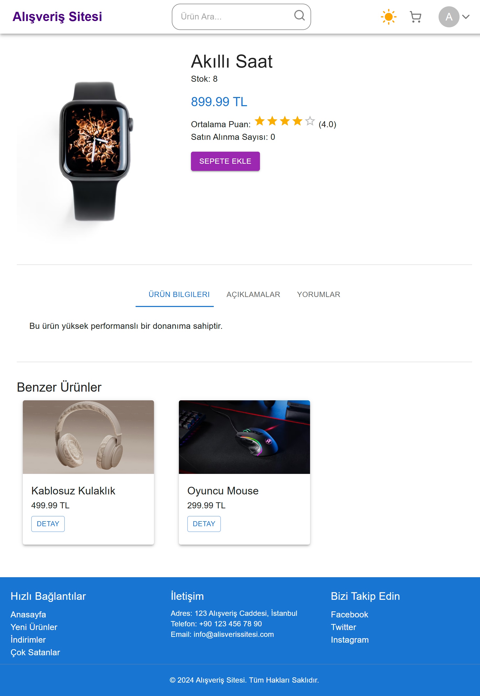
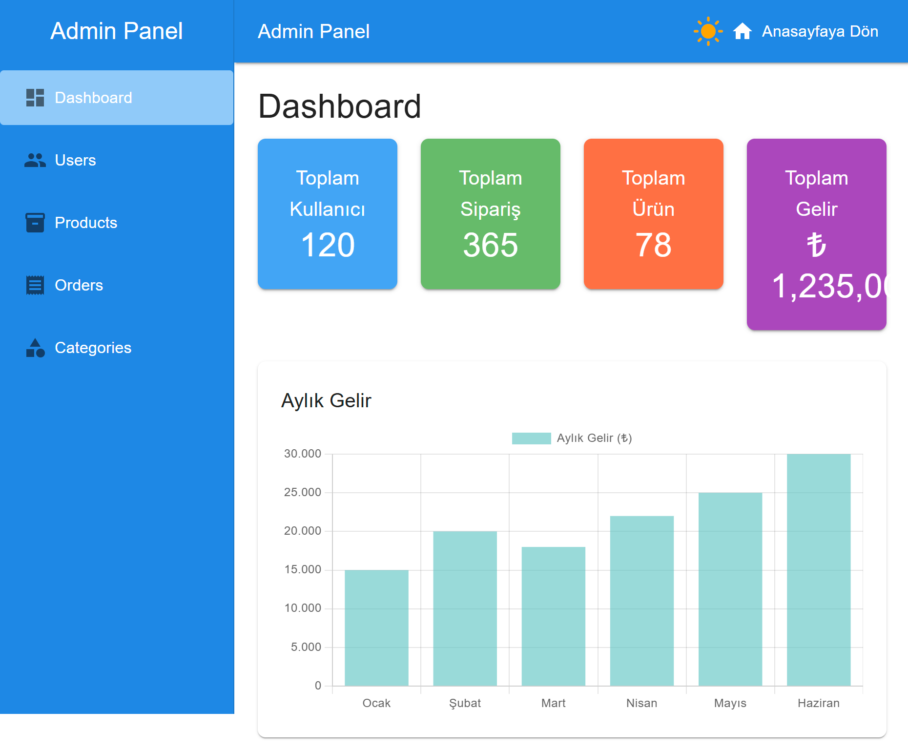

# 🛍️ Alışveriş Sitesi Frontend 

Kısa bir açıklama: Bu proje, web sitesi frontendini geliştirmek için oluşturulmuştur.

## 🎥 Proje Tanıtımı

**Canlı Demo:** [https://deniz-ilkay-alisveris-sitesi.netlify.app/](#)

**Ekran Görüntüleri:**

.



## 🚀 Özellikler
- 🎨 Modern ve duyarlı tasarım
- ⚡ Hızlı ve optimize edilmiş performans
- 🌍 Çapraz tarayıcı desteği

## 🛠️ Kurulum
Projeyi klonlayın:
```bash
git clone https://github.com/kullanici/proje-frontend.git
```
Gerekli bağımlılıkları yükleyin:
```bash
npm install  # veya yarn install
```

## 🎮 Kullanım
Geliştirme ortamında çalıştırmadan önce `.env` dosyanızın doğru yapılandırıldığından emin olun.
Geliştirme ortamında çalıştırmak için:
```bash
npm run dev  # veya yarn dev
```
Üretim için derlemek:
```bash
npm run build  # veya yarn build
```
## 🧪 Test Kullanıcıları
Bu proje için aşağıdaki test kullanıcılarını kullanabilirsiniz:

| Kullanıcı Türü | E-posta               | Şifre     |
|---------------|-----------------------|----------|
| **Kullanıcı** | `user@example.com`     | `user123` |
| **Admin**     | `admin@example.com`    | `admin123` |

📌 **Not:** Bu hesaplar yalnızca test amaçlıdır ve üretim ortamında kullanılmamalıdır.

## 📌 Gereksinimler
- Kullanıcı, backend'i çalıştırmak için mock data kullanabilir veya backend dosyasını indirerek çalıştırabilir.
- Backend bağlantısının düzgün çalışması için `.env` dosyanızda aşağıdaki değişkenlerin bulunması gerekmektedir. `VITE_USE_BACKEND` değişkenini `true` veya `false` olarak ayarlayarak backend kullanımını belirleyebilirsiniz:
  ```ini
  VITE_API_BASE_URL=http://localhost:3000
  VITE_USE_BACKEND=true
  ```
- Kullanıcı, backend'i çalıştırmak için mock data kullanabilir veya backend dosyasını indirerek çalıştırabilir.
- Node.js (en son sürüm önerilir)
- Paket yöneticisi (npm veya yarn)
- Tarayıcı desteği


