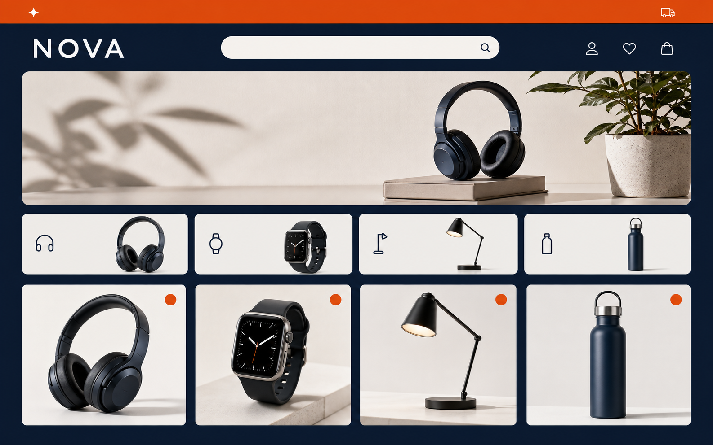

# NOVA — Demo E-Ticaret Mağazası

NOVA; ürün keşfi, kategori gezintisi, arama, favoriler, ürün detayı ve sepet
akışlarını bir araya getiren responsive bir e-ticaret frontend çalışmasıdır.

**Canlı demo:** [alisverissitem.dnzilkay.com](https://alisverissitem.dnzilkay.com/)



> Canlı uygulama sentetik katalog verileriyle çalışır. Gerçek ödeme, teslimat
> veya kullanıcı verisi işlenmez. Ayrı geliştirilen backend prototipi canlı
> deployment'a bağlı değildir.

## Öne çıkan özellikler

- Kampanya bandı, arama alanı ve kategori navigasyonu
- Beş kategori altında tutarlı demo ürün kataloğu
- İndirimli fiyat, puan, stok ve ürün özellikleri
- Yeni gelenler, fırsatlar ve çok satanlar koleksiyonları
- Ürün detay ve benzer ürün akışı
- Tarayıcıda kalıcı favoriler
- Sepet, adres ve demo sipariş adımları
- Açık/koyu tema ve responsive mobil deneyim
- Vercel için doğrudan SPA rota desteği
- Route bazlı kod bölme ve optimize production build

## Teknolojiler

- React 18
- TypeScript
- Vite
- Material UI
- React Router
- Prisma/Express backend prototipiyle uyarlanabilir servis katmanı

## Veri yaklaşımı

Uygulamanın varsayılan çalışma modu:

```dotenv
VITE_API_BASE_URL=http://localhost:3000
VITE_USE_BACKEND=false
```

`VITE_USE_BACKEND=false` olduğunda ürünler, kategoriler ve siparişler yalnızca
demo verileriyle çalışır. Canlı sitede kullanılan ve desteklenen mod budur.

Bağımsız backend çalışması:
[Alisveris-Sitem-Backend](https://github.com/dnzilkay/Alisveris-Sitem-Backend)

Backend repository'si veri modeli ve REST API yaklaşımını gösteren ayrı bir
prototiptir; bu frontend'in canlı sürümünü beslemez.

## Yerel geliştirme

```bash
npm install
npm run dev
```

Production build:

```bash
npm run build
```

Kod kalite kontrolü:

```bash
npm run lint
```

## Temel rotalar

| Rota | İçerik |
| --- | --- |
| `/` | Mağaza ana sayfası |
| `/search?q=...` | Ürün arama sonuçları |
| `/new-products` | Yeni gelen ürünler |
| `/discounts` | İndirimli ürünler |
| `/best-sellers` | Çok satan ürünler |
| `/favorites` | Favori ürünler |
| `/product/:id` | Ürün detayı |
| `/category/:id` | Kategori ürünleri |
| `/cart` | Sepet ve demo sipariş akışı |

## Proje durumu

Frontend canlı ve kullanılabilir bir demo olarak yayınlanmıştır. Backend
entegrasyonu bilinçli olarak devre dışıdır; proje portföyde bir e-ticaret
frontend vaka çalışması olarak sunulur.
